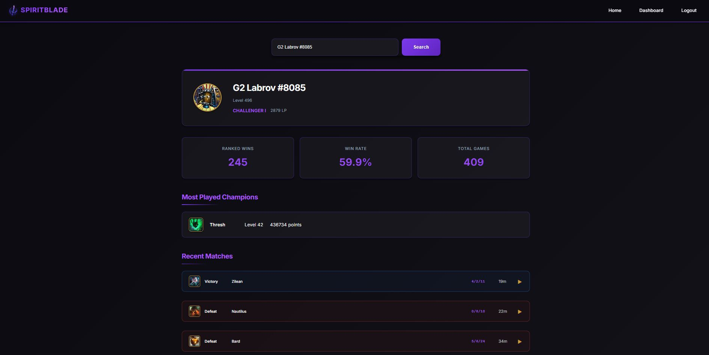
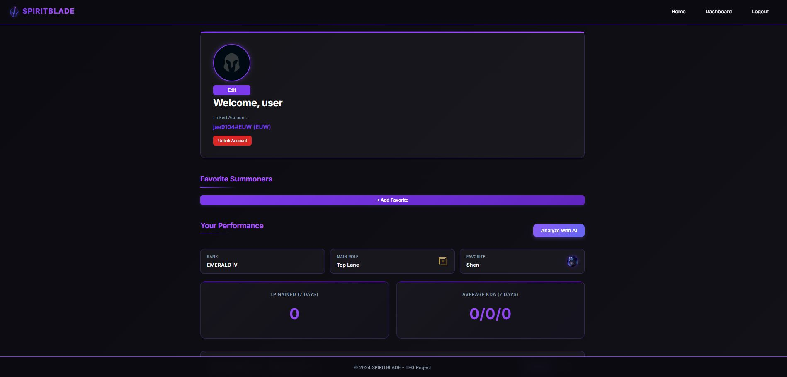
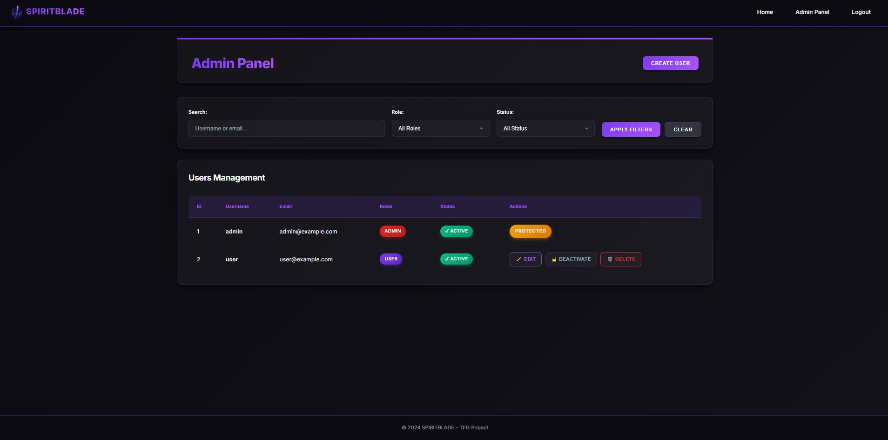

# SPIRITBLADE ⚔️

<p align="center">
  
</p>

<p align="center">
  <strong>Análisis y visualización de estadísticas de League of Legends</strong>
</p>

---

## 📋 Versión 1.0 - Funcionalidades Avanzadas

**SPIRITBLADE v1.0** es una aplicación web que permite a los jugadores de League of Legends buscar y visualizar estadísticas de invocadores en tiempo real. La aplicación se conecta a la API oficial de Riot Games para obtener información actualizada sobre perfil, rango, historial de partidas y estadísticas de campeones.

### Características principales:

✅ **Búsqueda de invocadores** por Riot ID (gameName#tagLine)  
✅ **Visualización de perfil** con nivel, icono y rango actual  
✅ **Historial de partidas** recientes con KDA y resultado  
✅ **Estadísticas de campeones** más jugados con nivel de maestría  
✅ **Sistema de autenticación** con JWT para usuarios registrados  
✅ **Panel de administración** para gestión de usuarios (rol ADMIN)  
✅ **Búsquedas recientes** en página de inicio  
✅ **Analisis con IA** básico de rendimiento en partidas
✅ **Despliegue con Docker** listo para producción

---

## 📸 Capturas de Pantalla (v0.1)

### Página Principal - Búsqueda
<p align="center">
  
</p>

### Perfil de Invocador
<p align="center">
  
</p>

### Dashboard de Usuario
<p align="center">
  
</p>

### Panel de Administración
<p align="center">
  
</p>

### Login
<p align="center">
  
</p>

## 📸 Capturas de Pantalla (v1.0)

### Página Principal - Búsqueda v1.0
<p align="center">
  
</p>

### Perfil de Invocador v1.0
<p align="center">
  
</p>

### Dashboard de Usuario v1.0
<p align="center">
  
</p>

### Panel de Administración v1.0
<p align="center">
  
</p>

---

## 🚧 Desarrollo Continuo

**SPIRITBLADE está en desarrollo activo.** La versión 1.0 representa el hito actual del proyecto, implementando las características completas de búsqueda y visualización. El desarrollo continúa siguiendo un proceso iterativo e incremental para añadir nuevas funcionalidades en versiones posteriores.

---

## 🎥 Video Demostración

> **[🎬 Ver video demostrativo](utils/demo/demo1-0.mp4)**

### Contenido del video:
El video demostrativo muestra las funcionalidades clave de SPIRITBLADE, incluyendo la búsqueda de invocadores, visualización de perfiles, historial de partidas y uso del panel de administración.


---

## 📚 Índice de Documentación

### Documentación Principal
- **[Funcionalidades](docs/Funcionalidades.md)** - Lista completa de funcionalidades implementadas y su descripción
- **[Ejecución](docs/Ejecucion.md)** - Instrucciones para ejecutar la aplicación localmente
- **[Despliegue Cloud](docs/Despliegue-Cloud.md)** - Guía completa de infraestructura y despliegue en Oracle Cloud
- **[Guía de Desarrollo](docs/Guia-Desarrollo.md)** - Guía técnica completa para desarrolladores

### Documentación de Gestión
- **[Seguimiento](docs/Seguimiento.md)** - Control de calidad, proceso de desarrollo y métricas
- **[Inicio del Proyecto](docs/Inicio-Proyecto.md)** - Objetivos, metodología y análisis inicial
- **[Autores](docs/Autores.md)** - Información sobre el equipo y el proyecto
- **[Reajuste de funcionalidades](docs/Reajuste-Funcionalidades.md)** - Cambios en el alcance y funcionalidades del proyecto

### Documentación Técnica Adicional
- **[API REST](docs/API.md)** - Documentación de endpoints
- **[Credenciales](docs/Credenciales.md)** - Gestión de roles y configuración de producción

---

## 🚀 Inicio Rápido

### 🔐 Configuración de Seguridad

**⚠️ IMPORTANTE**: Este proyecto usa variables de entorno para gestionar credenciales.


### 🔑 Credenciales de Desarrollo

**⚠️ Solo para demos y desarrollo local:**

- **Admin:** `admin` / `admin`
- **Usuario:** `user` / `pass`

**⚠️ NUNCA uses estas credenciales en producción**

---

### Ejecutar con Docker (Recomendado)

```bash
# 1. Clonar repositorio
git clone https://github.com/codeurjc-students/2025-SPIRITBLADE.git
cd 2025-SPIRITBLADE

# 2. Configurar variables de entorno
cp .env.example .env
# Editar .env con tus credenciales (ver SECURITY.md)

# 3. Iniciar aplicación
cd docker
docker-compose up -d
```

Acceder a: **https://localhost:443**

Ver **[Guía de Ejecución completa](docs/Ejecucion.md)** para más detalles.

---

## 🛠️ Tecnologías

| Componente | Tecnología |
|------------|------------|
| **Frontend** | Angular 17, TypeScript, SCSS |
| **Backend** | Spring Boot 3.4.3, Java 21 |
| **Base de Datos** | MySQL 8.0 |
| **Caché** | Redis, Spring Cache |
| **Almacenamiento** | MinIO (desarrollo), Oracle Object Storage (producción) |
| **Seguridad** | Spring Security, JWT |
| **Orquestación** | Kubernetes (OKE), Docker, Docker Compose |
| **Infraestructura** | Terraform, Oracle Cloud Infrastructure |
| **CI/CD** | GitHub Actions |
| **Control de Calidad** | JUnit 5, Jasmine/Karma, SonarCloud |

---

## ☁️ Despliegue en Kubernetes

SPIRITBLADE está preparado para desplegarse tanto en entornos de desarrollo local como en producción en Oracle Cloud.

### Despliegue Rápido - Desarrollo (5 minutos)

```bash
cd k8s/dev
.\deploy.ps1  # Windows
# o
./deploy.sh   # Linux/Mac
```

### Despliegue en Producción - Oracle Cloud (30 minutos)

```bash
# 1. Configurar infraestructura
cd iac/terraform
terraform init
terraform apply

# 2. Desplegar aplicación
cd ../../k8s/prod
kubectl apply -f namespace.yaml
kubectl apply -f secrets.yaml
kubectl apply -f .
```

**Documentación completa**:
- 📖 [Guía Rápida de Despliegue](k8s/QUICK-START.md)
- 📖 [Guía Completa de Kubernetes](k8s/README.md)
- 📖 [Configuración de Terraform](iac/terraform/README.md)
- 📖 [Checklist de Verificación](k8s/CHECKLIST.md)

### Arquitectura en Oracle Cloud

```
Oracle Cloud Infrastructure (Free Tier)
├── OKE Cluster (Kubernetes)
│   ├── Backend (2 pods)
│   ├── Frontend (2 pods + LoadBalancer)
│   └── Redis (StatefulSet)
├── MySQL (Compute Instance ARM)
└── Object Storage (S3-compatible)
```

**Costos**: $0/mes usando Oracle Cloud Free Tier 🎉

---

## 📊 Estado del Proyecto

[](https://github.com/codeurjc-students/2025-SPIRITBLADE/actions)
[](https://sonarcloud.io/summary/new_code?id=codeurjc-students_2025-SPIRITBLADE)

**Versión actual**: 1.0.0 
**Última actualización**: Noviembre 2025 
**Estado**: ✅ Funcional - Desarrollo Activo

---

## 🔗 Enlaces

- **Repositorio**: [GitHub - SPIRITBLADE](https://github.com/codeurjc-students/2025-SPIRITBLADE)
- **Docker Hub**: [Spiritblade Docker Hub](https://hub.docker.com/repository/docker/jae9104/spiritblade/general)
- **Blog del proyecto**: [Medium - SPIRITBLADE](https://medium.com/@j.andres.2022/fase-1-tfg-5ecf33a800e3)
- **Issues y Tareas**: [GitHub Projects](https://github.com/codeurjc-students/2025-SPIRITBLADE/projects)

---

## 👨‍💻 Autoría

**SPIRITBLADE** es un Trabajo de Fin de Grado (TFG) desarrollado para el doble grado en Ingeniería Informática e Ingeniería del Software en la ETSII (Universidad Rey Juan Carlos).

- **Estudiante**: Jorge Andrés Echevarría
- **Tutor**: Iván Chicano Capelo
- **Universidad**: URJC - ETSII
- **Curso**: 2025-2026

---

## 📄 Licencia

Este proyecto está bajo licencia. Ver archivo [LICENSE](LICENSE) para más detalles.

---

<p align="center">
  <sub>⚔️ SPIRITBLADE - Domina el campo de batalla con información</sub>
</p>
