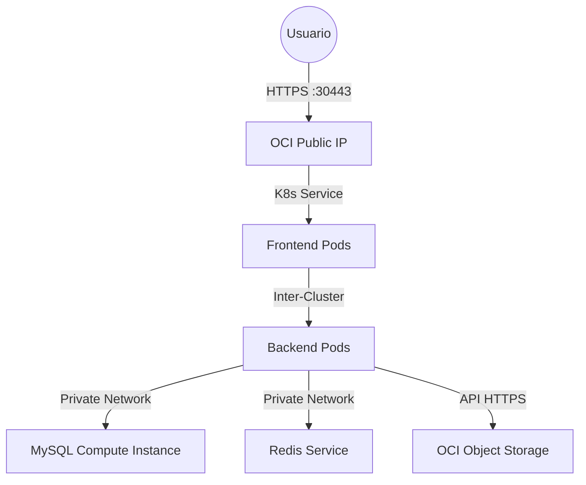

# Guía Completa de Despliegue en Cloud (Oracle OCI) | SPIRITBLADE

Esta documentación centraliza todo lo relacionado con el despliegue de la infraestructura y la aplicación Spiritblade en Oracle Cloud Infrastructure (OCI), utilizando su capa gratuita (**Free Tier**).

---

## 1. Stack Tecnológico

| Componente | Tecnología | Descripción |
|------------|------------|-------------|
| **Cloud Provider** | Oracle Cloud (OCI) | Región `eu-madrid-1` (o similar). Uso de Free Tier. |
| **Orquestador** | Kubernetes (OKE) | Oracle Container Engine for Kubernetes. |
| **Infraestructura** | Terraform | IaaC para provisionar redes, cluster y computación. |
| **Base de Datos** | MySQL 8.0 | Desplegada en una instancia Compute (VM) independiente. |
| **Backend** | Spring Boot | Dockerizado (Java 21). |
| **Frontend** | Angular + Nginx | Dockerizado. |
| **Cache** | Redis | Desplegado como servicio en Kubernetes. |
| **Almacenamiento** | OCI Object Storage | Compatible con API S3 para guardar avatares/imágenes. |

---

## 2. Límites y Restricciones (OCI Free Tier)

El proyecto está diseñado meticulosamente para no incurrir en costes, aprovechando al máximo los recursos ARM de Oracle.

### Recursos de Computación (Ampere A1)
Tienes una bolsa total de recursos ARM gratuita para repartir entre tus máquinas:
- **Total Disponible:** 4 OCPUs y 24 GB de RAM.
- **Distribución en Spiritblade:**
    - **Cluster K8s (2 Nodos):** 2 OCPUs + 12 GB RAM (6GB por nodo).
    - **Servidor Base de Datos (1 Instancia):** 1 OCPU + 6 GB RAM.
    - **Libre/Reserva:** 1 OCPU + 6 GB RAM.

### Red y Tráfico
- **Entrada (Ingress):** Gratuita e ilimitada.
- **Salida (Egress):** **10 TB al mes** gratuitos a Internet.
- **Protección:** OCI incluye mitigación DDoS básica gratuita.

> **Importante:** Las instancias usan arquitectura **ARM64 (aarch64)**. Las imágenes Docker DEBEN construirse como multi-arquitectura o nativas para ARM64, o fallarán con `Exec format error`.

---

## 3. Arquitectura de Despliegue



---

## 4. Guía de Despliegue Paso a Paso

### Fase 1: Provisionar Infraestructura (Terraform)
Ubicación: `iac/terraform/`

1.  **Requisitos:** Tener OCI CLI configurado y Terraform instalado.
2.  **Configuración:** Crear archivo `terraform.tfvars`:
    ```hcl
    tenancy_ocid     = "ocid1.tenancy.oc1..."
    user_ocid        = "ocid1.user.oc1..."
    fingerprint      = "xx:xx:xx..."
    private_key_path = "/path/to/key.pem"
    region           = "eu-madrid-1"
    compartment_ocid = "ocid1.compartment.oc1..."
    ```
3.  **Ejecución:**
    ```bash
    terraform init
    terraform apply -auto-approve
    ```
4.  **Resultado:** Terraform creará la VCN, subnets, el cluster OKE y la instancia MySQL. Al finalizar te dará los OUTPUTS necesarios (IPs, IDs).

### Fase 2: Configuración del Entorno Kubernetes

1.  **Generar Kubeconfig:** (Copiar comando del output de Terraform)
    ```bash
    oci ce cluster create-kubeconfig --cluster-id <ID> --file $HOME/.kube/config --region <REGION> --token-version 2.0.0
    ```
2.  **Verificar Nodos:** `kubectl get nodes` (Deben salir 2 nodos ARM Ready).

### Fase 3: Construcción de Imágenes (Docker Multi-Arch)

Debido a los nodos ARM, **es obligatorio** construir para esa arquitectura.

```bash
# Backend
docker buildx build --platform linux/amd64,linux/arm64 -t <TU_USUARIO>/spiritblade-backend:latest -f docker/Dockerfile.backend . --push

# Frontend
docker buildx build --platform linux/amd64,linux/arm64 -t <TU_USUARIO>/spiritblade-frontend:latest -f docker/Dockerfile.frontend . --push
```

### Fase 4: Despliegue de Aplicación (Kubernetes)
Ubicación: `k8s/prod/`

1.  **Namespace:**
    ```bash
    kubectl apply -f k8s/prod/namespace.yaml
    ```
2.  **Secretos:** (Editar `secrets.yaml` con contraseñas reales antes de aplicar)
    ```bash
    kubectl apply -f k8s/prod/secrets.yaml -n prod
    ```
    *Asegúrate de que `mysql-root-password` coincide con la definida en `iac/terraform/mysql-init.sh` o la que configuraste en la DB.*
3.  **Servicios Base:**
    ```bash
    kubectl apply -f k8s/prod/redis-statefulset.yaml -n prod
    kubectl apply -f k8s/prod/mysql-external-service.yaml -n prod
    ```
4.  **Aplicación:**
    ```bash
    kubectl apply -f k8s/prod/backend-deployment.yaml -n prod
    kubectl apply -f k8s/prod/frontend-deployment.yaml -n prod
    ```

---

## 5. Mantenimiento y Operativa

### Acceso a la Aplicación
Al usar `NodePort` para ahorrar costes de Load Balancer:
- **URL:** `https://<IP-PUBLICA-NODO>:30443`
- La IP pública se obtiene con: `kubectl get nodes -o wide` (EXTERNAL-IP).

### Configuración de Base de Datos (MySQL)
La base de datos corre en una VM separada por rendimiento y persistencia.
- **Seguridad:** Firewall (NSG) configurado por Terraform para aceptar tráfico **solo** desde la subnet privada del Cluster K8s.
- **Acceso Administrativo:** Si necesitas entrar manualmente, usa SSH a través de la IP de la instancia (puerto 22 abierto si se configura la llave SSH en Terraform).

### Solución de Problemas Comunes

1.  **Error `Exec format error` / `CrashLoopBackOff`**:
    - **Causa:** Has desplegado una imagen AMD64 en un nodo ARM.
    - **Solución:** Reconstruir con `docker buildx ... --platform linux/arm64 ...`.

2.  **Error CORS en Frontend**:
    - **Causa:** El backend bloquea peticiones de un origen desconocido.
    - **Solución:** Verificar configuración de Spring Security para permitir orígenes `*` o la IP específica del nodo.

3.  **Conexión DB Rechazada**:
    - **Causa:** Firewall de la VM MySQL o credenciales incorrectas.
    - **Solución:** Verificar el secreto de Kubernetes y que el Security Group de OCI permita tráfico al puerto 3306 desde la VCN.

---

## 6. Limpieza de Recursos (Destruir todo)

Para evitar costes si sales del Free Tier o quieres limpiar:

```bash
cd iac/terraform
terraform destroy -auto-approve
```
*Esto eliminará el cluster, la base de datos y las redes. No elimina el Object Storage si contiene datos (por seguridad).*
