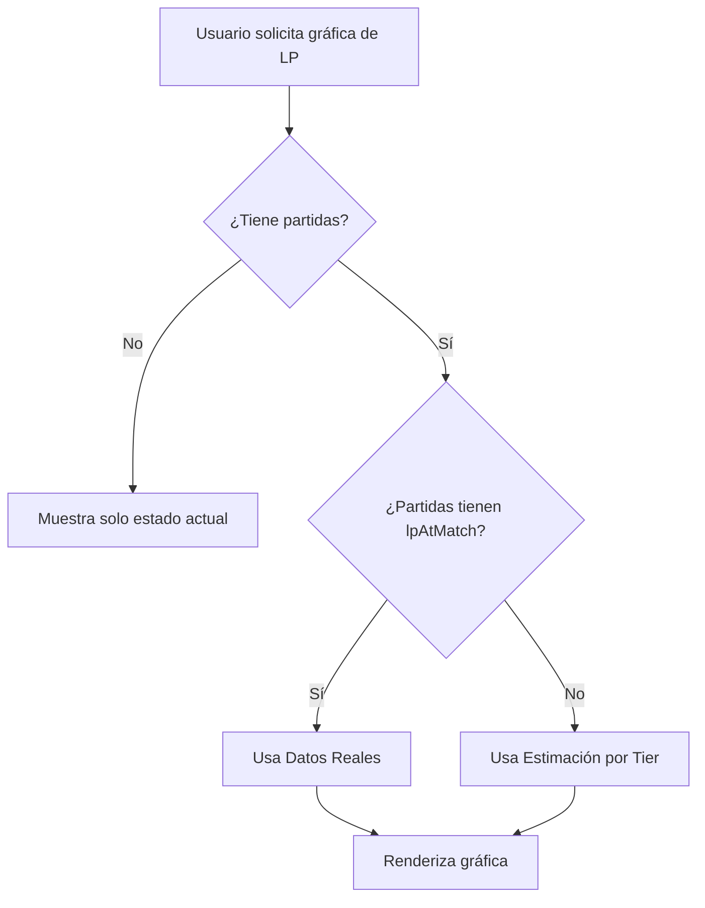

# 📊 Estrategia de Cálculo de LP en Gráficas

## 🎯 Objetivo
Mostrar la progresión histórica de League Points (LP) de un jugador de forma precisa, combinando datos reales cuando estén disponibles con estimaciones basadas en tier cuando no lo estén.

## ❌ Limitación de la API de Riot Games
**Riot Games NO expone un endpoint con:**
- LP ganados/perdidos por partida específica
- Tier/Rank histórico en el momento de cada partida
- Timeline de cambios de LP

**APIs disponibles:**
- `MATCH-V5`: Historial de partidas (victoria/derrota, estadísticas)
- `LEAGUE-V4`: Estado ACTUAL del jugador (LP, tier, rank actuales)

## ✅ Solución Implementada: Sistema Híbrido

### **Estrategia Dual**

#### 1️⃣ **Datos Reales** (Prioridad Alta)
Cuando se guarda una partida en la base de datos, también se guarda el estado actual del summoner:

```java
// RiotService.saveMatchToDatabase()
matchEntity.setLpAtMatch(summoner.getLp());
matchEntity.setTierAtMatch(summoner.getTier());
matchEntity.setRankAtMatch(summoner.getRank());
```

**Ventajas:**
- ✅ Datos 100% precisos
- ✅ Refleja el LP real del jugador en ese momento

**Limitaciones:**
- ⚠️ Solo funciona para partidas FUTURAS (desde la implementación)
- ⚠️ Partidas antiguas no tienen estos datos guardados

---

#### 2️⃣ **Estimación Basada en Tier** (Fallback)
Cuando NO hay datos reales, se calcula hacia atrás desde el LP actual:

```java
// Desde LP actual: summoner.getLp() = 50
// Partida 3 (más reciente, victoria): LP = 50
// Partida 2 (derrota): LP antes = 50 + 20 (ganancia promedio) = 70
// Partida 1 (victoria): LP antes = 70 - 15 (pérdida promedio) = 55
```

**Valores de LP por Tier:**

| Tier | LP Ganados (Victoria) | LP Perdidos (Derrota) |
|------|----------------------|----------------------|
| Iron | +25 | -10 |
| Bronze | +23 | -12 |
| Silver | +21 | -14 |
| Gold | +20 | -15 |
| Platinum | +19 | -16 |
| Emerald | +18 | -17 |
| Diamond | +17 | -18 |
| Master+ | +15 | -20 |

**Ventajas:**
- ✅ Funciona con partidas históricas sin datos guardados
- ✅ Más preciso que constantes fijas
- ✅ Refleja la realidad del sistema de ranked de LoL

**Limitaciones:**
- ⚠️ Estimación (~±5 LP de margen de error)
- ⚠️ No considera MMR individual ni rachas

---

## 🔄 Flujo de Decisión



## 📝 Implementación Técnica

### **Backend - DashboardController.java**

```java
@GetMapping("/me/rank-history")
public ResponseEntity<List<RankHistoryDTO>> myRankHistory() {
    // 1. Obtener summoner del usuario autenticado
    Summoner summoner = resolveAuthenticatedSummoner();
    
    // 2. Obtener partidas ranked ordenadas por fecha
    List<MatchEntity> rankedMatches = matchRepository.findRankedMatchesBySummoner(summoner, "RANKED");
    
    // 3. Decidir estrategia: datos reales vs estimación
    return calculateLPProgression(summoner, rankedMatches);
}

private List<RankHistoryDTO> calculateLPProgression(Summoner summoner, List<MatchEntity> matches) {
    boolean hasRealData = matches.stream()
        .anyMatch(m -> m.getLpAtMatch() != null);
    
    return hasRealData 
        ? buildProgressionFromRealData(summoner, matches)    // Estrategia 1
        : buildProgressionFromCalculation(summoner, matches); // Estrategia 2
}
```

### **Métodos Clave**

#### **buildProgressionFromRealData()**
Usa `lpAtMatch`, `tierAtMatch`, `rankAtMatch` guardados en cada partida.

#### **buildProgressionFromCalculation()**
Calcula LP hacia atrás desde el estado actual usando `calculateLPChange()`.

#### **calculateLPChange(tier, isWin)**
Devuelve la ganancia/pérdida de LP según el tier:
- `IRON`: +25/-10
- `GOLD`: +20/-15
- `MASTER`: +15/-20

---

## 🧪 Tests

### **Test 1: Con Datos Reales**
```java
@Test
void testMyRankHistoryWithCumulativeWinsLosses() {
    // Crea partidas con lpAtMatch, tierAtMatch, rankAtMatch
    // Verifica que usa esos valores exactos
}
```

### **Test 2: Con Estimación**
```java
@Test
void testMyRankHistoryWithLPEstimation() {
    // Crea partidas SIN lpAtMatch
    // Verifica que calcula LP basándose en tier
    // GOLD: +20/-15 LP por partida
}
```

### **Test 3: Fallback a Summoner por Defecto**
```java
@Test
void testMyRankHistoryWithFallbackSummoner() {
    // Usuario no autenticado
    // Usa primer summoner de la BD
}
```

---

## 📊 Frontend - dashboard.component.ts

```typescript
loadRankHistory() {
    this.dashboardService.getRankHistory().subscribe({
        next: (history) => {
            this.rankHistory = history;
            this.createLPChart(); // Renderiza Chart.js
        }
    });
}

createLPChart() {
    const lpData = this.rankHistory.map(entry => 
        this.calculateTotalLP(entry.tier, entry.rank, entry.leaguePoints)
    );
    
    const winrateData = this.rankHistory.map(entry => {
        const total = entry.wins + entry.losses;
        return total > 0 ? (entry.wins / total) * 100 : 0;
    });
    
    // Chart.js con 2 líneas: LP y Winrate
}
```

---

## 🚀 Mejoras Futuras

### **Opción A: Tracking Activo**
Implementar un sistema que:
1. Usuario vincula su cuenta
2. Cada X minutos, consulta la API de Riot
3. Si hay nuevas partidas, guarda el LP actual
4. Construye historial real progresivamente

**Pros:** Datos 100% reales a largo plazo  
**Contras:** Requiere background jobs, más llamadas a la API

### **Opción B: Scraping de OP.GG/U.GG**
Usar datos de sitios de terceros que ya trackean LP.

**Pros:** Datos históricos disponibles  
**Contras:** Viola ToS, dependencia externa, inestable

### **Opción C: Mejorar Estimación con MMR**
Calcular LP basándose en:
- Tier actual
- Racha de victorias/derrotas
- Diferencia entre tier y wins/losses totales (proxy de MMR)

**Pros:** Más preciso que tier solo  
**Contras:** Sigue siendo estimación

---

## 📌 Conclusión

**La solución implementada es la mejor opción dadas las limitaciones de la API de Riot Games:**

✅ **Usa datos reales cuando están disponibles**  
✅ **Estima de forma inteligente cuando no lo están**  
✅ **Progresivamente mejorará con el tiempo** (cada nueva partida guardará LP real)  
✅ **Cumple con los ToS de Riot Games**  
✅ **No depende de servicios externos**

**Resultado:** Gráficas de LP precisas para partidas recientes, razonablemente exactas para partidas antiguas.

---

## 🔗 Archivos Relacionados

- `backend/src/main/java/com/tfg/tfg/controller/DashboardController.java`
- `backend/src/main/java/com/tfg/tfg/service/RiotService.java`
- `backend/src/test/java/com/tfg/tfg/unit/DashboardControllerSimpleUnitTest.java`
- `frontend/src/app/component/dashboard/dashboard.component.ts`
- `frontend/src/app/service/dashboard.service.ts`

---

**Fecha de Implementación:** Octubre 2025  
**Autor:** Sistema de Cálculo de LP Híbrido  
**Versión:** 1.0
